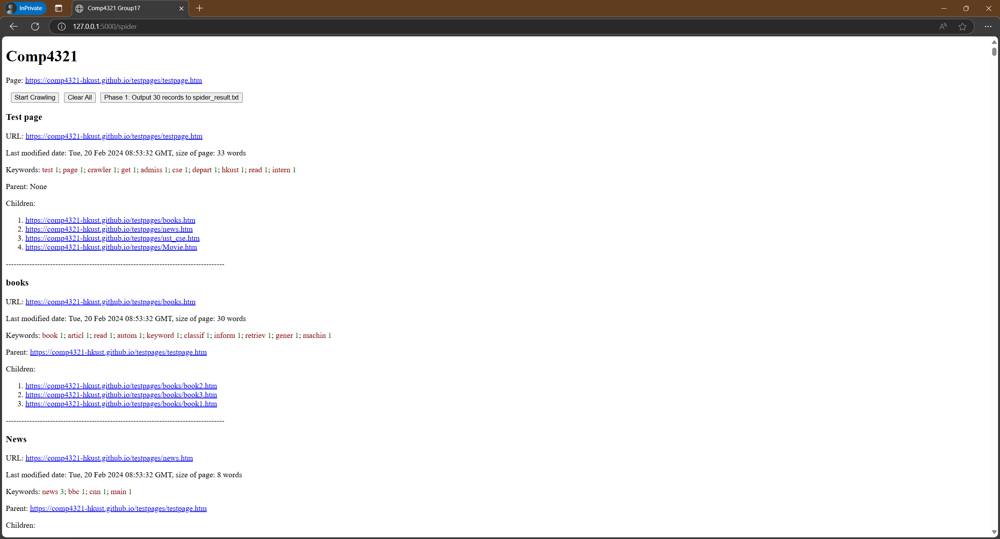

# COMP4321 Search Engine Project - Group 17

## Setup Instructions

1. **Create Virtual Environment**
```bash
python -m venv venv
```

2. **Activate & Install Dependencies**

**Linux/MacOS**
```bash
source venv/bin/activate
chmod +x setup.sh
./setup.sh
```
**Windows**
```bash
venv\Scripts\activate
pip install -r requirements.txt
python -c "import nltk; nltk.download('punkt')"
```

3. **Initialize Database**
```bash
flask init-db
```

4. **Start Development Server**
```bash
python app.py
```

## Accessing the Web Interface
- The search engine interface will be available at: http://localhost:5000/, which will automatically redirect to the spider page http://localhost:5000/spider
- Click "Clear All" to clear all indexed pages
- Click "Start Crawl" to begin indexing pages
- The web page will automatically refresh every new page crawled (manually refresh if needed)

## Phase 1
- In the Web Interface, click "Phase 1" button to output 30 records to `spider_result.txt` in project root after at least 30 pages have been crawled

## Important Notes
- Ensure `stopwords.txt` exists in project root
- Server may take several minutes to index pages after starting crawl
- Use Chrome/Firefox for best compatibility
- Monitor terminal output for crawl progress
- Program is tested to be fine under Python 3.12.0

